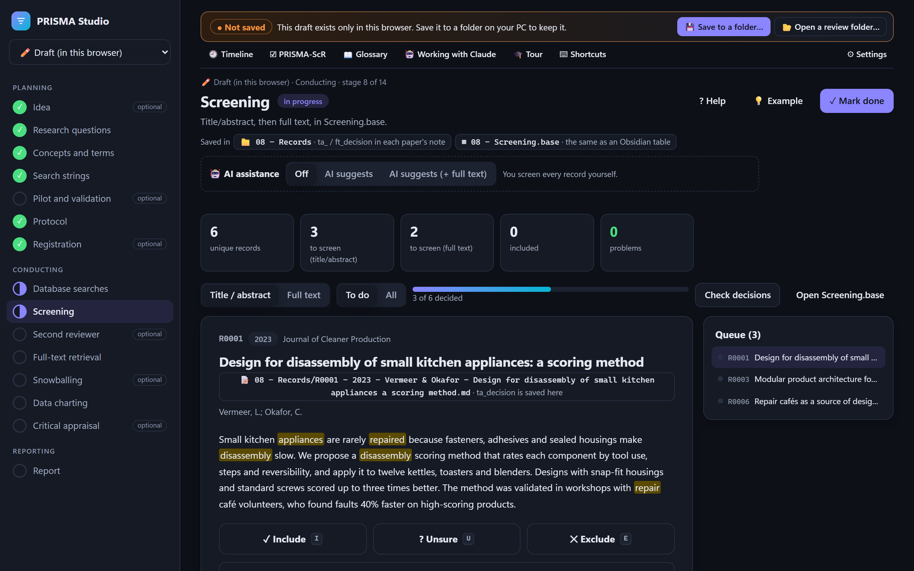
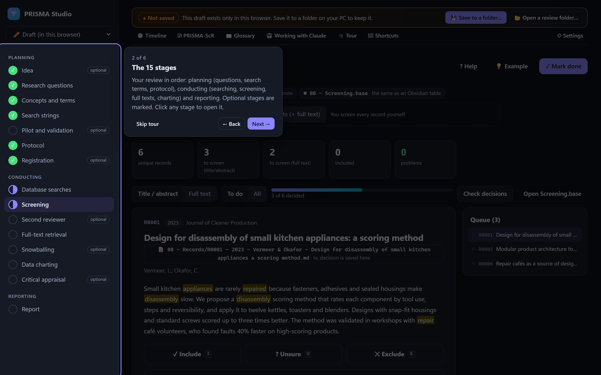

# PRISMA Studio

**A scoping-review workbench (PRISMA-ScR) that runs in your browser and keeps every review in a folder on your own PC.**

👉 **Open it: https://robotat-tube.github.io/prisma-studio/** (Chrome or Edge on a computer)

PRISMA Studio walks you through a scoping review from the first idea to the PRISMA flow diagram: questions, search strings, protocol, database imports, screening, full texts, charting and the report. Your review is a plain folder of Markdown notes, CSV tables and PDFs: nothing is uploaded, there is no account, and the folder opens in Obsidian or any text editor.



*Screening in PRISMA Studio (example data). Search terms are highlighted in the abstract; I / U / E decide.*



*The 1-minute app tour, offered on your first visit.*

## Contents

- [Getting started](#getting-started)
- [The 15 stages](#the-15-stages)
- [Your review folder](#your-review-folder)
- [AI assistance with Claude (optional)](#ai-assistance-with-claude-optional)
- [Privacy and data safety](#privacy-and-data-safety)
- [Run it on your own PC](#run-it-on-your-own-pc)
- [For developers](#for-developers)

## Getting started

1. Open **https://robotat-tube.github.io/prisma-studio/** in **Chrome or Edge**.
2. You land straight in the workspace, on a **draft** review kept in your browser: start with your idea and research questions right away.
3. When you want to keep it, press **💾 Save to a folder…** in the bar at the top: give the review a name and pick a place on your PC. From then on every change is written to that folder.
4. Next time, the same bar offers **📂 Open a review folder…** and **▶ Continue** for the reviews you opened before. The browser asks once per visit before the app may edit a folder.

New here? On your first visit the app offers a **1-minute tour** (🎓 Tour at the top replays it).

Tip: install it as an app (install icon at the right of the address bar). It then opens in its own window and works **offline**.

## The 15 stages

| # | Stage | What you do |
|---:|---|---|
| 0 | Idea *(optional)* | Write down, with dates, what you want to find out and why. |
| 1 | Research questions | Population–Concept–Context and the review questions; every version is kept. |
| 2 | Concepts and terms | One block per concept with all synonyms and spellings, combined with AND. |
| 3 | Search strings | Strings generated per database (Scopus, IEEE Xplore, OpenAlex, …) from the concept table. |
| 4 | Pilot and validation *(optional)* | Trial runs: hit count and how many papers of your test set a string finds. |
| 5 | Protocol | The protocol text, generated from stages 1–4 plus the method sections. |
| 6 | Registration *(optional)* | Freeze the protocol before searching; later changes become logged amendments. |
| 7 | Database searches | Import each export (RIS, BibTeX, CSV) with its exact string and date; duplicates are merged. |
| 8 | Screening | Title/abstract, then full text, with keyboard shortcuts and exclusion reasons. |
| 9 | Second reviewer *(optional)* | A blind sample of ≥ 20 % for a second reviewer, with Cohen's κ. |
| 10 | Full-text retrieval | Find and attach the PDFs (it can match them in your own folders), or mark them not retrieved. |
| 11 | Snowballing *(optional)* | Citation rounds from the included papers until a round adds nothing new. |
| 12 | Data charting | The charting form for every included paper, with page locators. |
| 13 | Critical appraisal *(optional)* | Appraise each included source. |
| 14 | Report | PRISMA flow diagram, PRISMA-ScR checklist, report draft and exports. |

Keyboard shortcuts while screening: **I** include · **U** unsure · **E** exclude · **1–9** reason · **← / →** previous / next.

## Your review folder

A review is one folder named `<review name> records`:

```
Project 2 review records/
├── 00 - Review log.md          every action, dated
├── 00 - Review timeline.md     the review's history in one note
├── 03 - Search strategy.md
├── 05 - Protocol.md
├── 07 - Searches.csv           one row per search: database, string, date, counts
├── 07 - Exports/               the original database exports
├── 08 - Records/               one Markdown note per paper (R0001 - 2024 - Liu et al. - ….md)
├── 08 - Screening guide.md     eligibility criteria and exclusion reasons
├── 09 - Second reviewer/       blind sample sheets (CSV)
├── 10 - Full texts/            the PDFs, named after their record
├── 14 - PRISMA flow.md
├── 14 - PRISMA-ScR checklist.md
└── review_state.json           stages, protocol, settings
```

Each record note keeps its decisions in its properties (`ta_decision`, `ft_decision`, `ta_reason`, …), so you can also browse and filter the review in Obsidian. *Settings → Review settings* links the folder to your Obsidian vault, so notes open there with one click.

## AI assistance with Claude (optional)

Each stage that can use help has an **🤖 AI assistance** card where you choose whether to use it. It is off by default. When it's on, [Claude Code](https://claude.com/claude-code) can:

- **pre-screen** titles and abstracts, or full texts, and suggest a decision with a reason;
- **fetch full texts** (open access first) and attach the PDFs;
- act as a **blind second reviewer** on the sample;
- **prefill the charting form** from the PDFs, with page locators.

Claude only ever *suggests*: you confirm or change every suggestion in PRISMA Studio, each AI action is logged with the model and date, and the protocol's "Use of AI assistance" section is written for you.

How to use it: open this repository's folder in Claude Code, press **📋 Copy prompt** on the AI card and paste it. The skills are in `.claude/skills/`; they work through `node bin/ai-assist.js`, which refuses whenever the review has the AI switched off for that step. Keep PRISMA Studio open next to it: it notices Claude's changes and shows them.

## Privacy and data safety

- **Nothing leaves your PC.** The app is a static web page; your review folder is read and written by your own browser. The only network requests are searches you start yourself (OpenAlex) and loading the app.
- **Your files stay readable.** Plain Markdown, CSV and JSON: no database, no lock-in.
- **Edits made elsewhere are kept.** If you change a note in Obsidian while the app is open, saving that record in the app keeps your edit. If Claude changes the review, the app re-reads it.
- **Tip:** keep the review folder under version control (git) or in a synced folder, so you can always go back.

## Run it on your own PC

You can also run PRISMA Studio locally, for example to work offline or to change it:

1. Install [Node.js](https://nodejs.org) (version 20 or later).
2. Download this repository (green **Code** button → *Download ZIP*, or `git clone`).
3. Double-click **`Start PRISMA Studio.cmd`** (Windows). It installs what is needed the first time, starts the app and opens it in Chrome or Edge.

Or from a terminal:

```
npm install
npm run serve            # then open http://localhost:8770/web/
```

## For developers

Plain JavaScript (ES modules), no framework and no bundler; the only dependency is [pdf.js](https://mozilla.github.io/pdf.js/) for reading PDFs. The code is split into layers (domain rules, ports, services, adapters, UI). See [ARCHITECTURE.md](ARCHITECTURE.md).

```
npm test                 # unit tests
npm run check            # architecture: each layer imports only what it may
npm run build            # the static site in dist/
node scripts/bench-open.js "<copy of a … records folder>"   # how fast a review opens
node scripts/readme-screenshot.js   # docs/screenshot.png and docs/tour.png, with example data (needs npm run serve)
```

Every push to `main` is tested, built and published on GitHub Pages (`.github/workflows/pages.yml`). Review data is never part of this repository.
